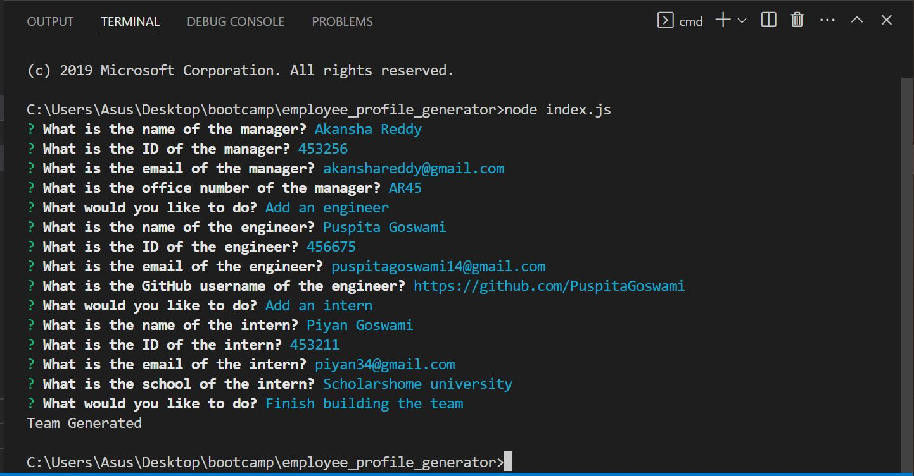
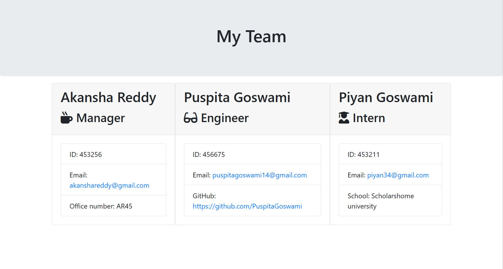

# employee_profile_generator

This is a command-line application that generates a team profile HTML file based on user input. The application prompts the user to enter information about a manager, engineers, and interns on the team. The user can add multiple engineers and interns to the team. Once the user is finished entering team information, the application generates an HTML file that displays the team members' information in a nicely formatted way.

## Table of Contents
- [Installation](#Installation)
- [Usage](#Usage)
- [License](#License)
- [Contributing](#Contributing)
- [Tests](#Tests)
- [Questions](#Questions)

## Installation {#Installation}
To install the application, follow these steps:

Clone the repository to your local machine.
Install Node.js if it is not already installed on your machine.
Open a terminal window and navigate to the root directory of the project.
Run the command npm install to install the required dependencies.
## Usage {#Usage}
To use the application, follow these steps:

Open a terminal window and navigate to the root directory of the project.
Run the command node index.js to start the application.
Follow the prompts to enter information about the manager, engineers, and interns on the team.
When you are finished entering team information, select "Finish building the team" from the menu to generate the team profile HTML file.
The generated HTML file will be located in the "output" directory.

## License
This project is licensed under the MIT license.

##Contributing
N/A

## Tests
To run tests for the application, follow these steps:

Open a terminal window and navigate to the root directory of the project.
Run the command npm test to run the test suite.

## Questions
If you have any questions about the project, open an issue or contact me directly at puspitagoswami14@gmail.com. You can find more of my work on my Github profile: https://github.com/PuspitaGoswami.

